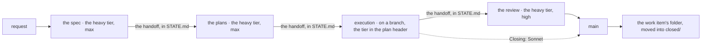
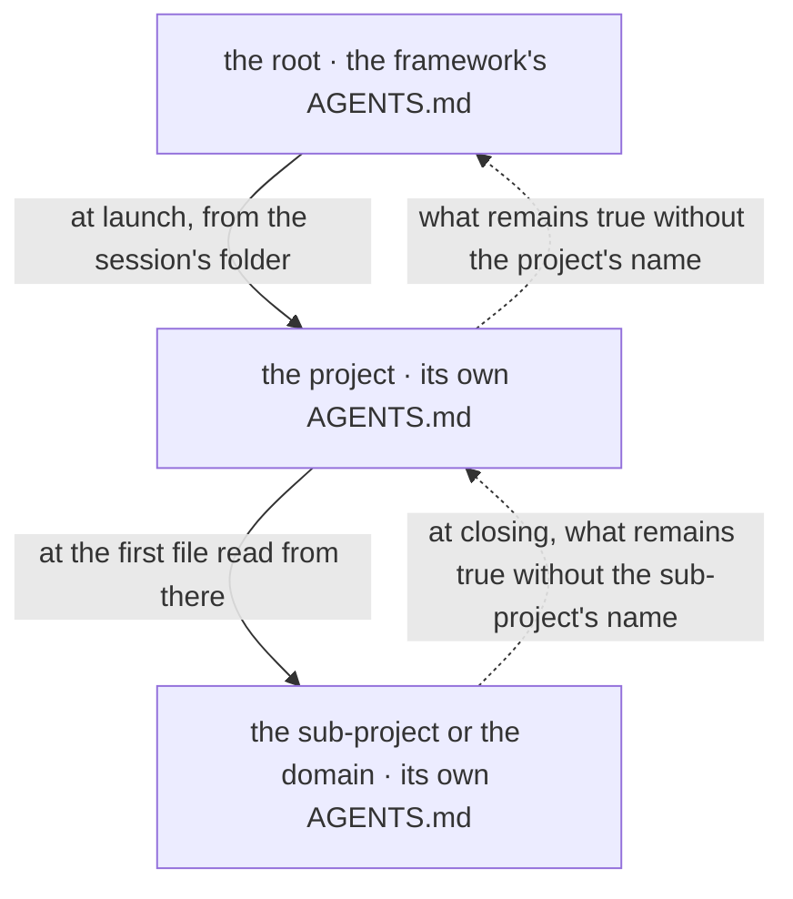
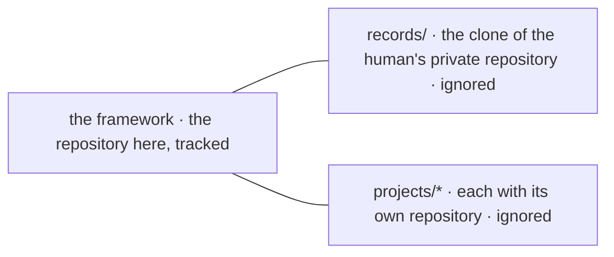

# ai-workspace

A workspace for Claude Code, Antigravity, and other AI coding tools where work lasting
several days is not lost when a conversation ends: everything a new session needs to
continue another's work sits in files. It is built for projects too large for a single
conversation, worked alone or in a small team.

The repository holds the **framework**: the rules, house skills, verification tools,
and a new project's template. Projects sit in `projects/`, each in its own
repository.

## How it works



A request passes through four new sessions, each opened by the human: the spec (the
document deciding what is built and how), the plans, execution on a branch, and the
review, which merges the branch into `main`. Each session leaves the next one a
**handoff**, a note in `STATE.md` with each tool's model, effort, and prompt.

Each session can run in a different tool: the plan names a tier, heavy or execution,
and the tool's module maps that tier to a concrete model.

A plan with `Closing: Sonnet` enters `main` directly from execution. The full rules are
in [AGENTS.md](AGENTS.md) for any tool; what belongs only to Claude Code sits in
[CLAUDE.md](CLAUDE.md), and what belongs only to Antigravity sits in [GEMINI.md](GEMINI.md).

## A whole example

A two-line work item carried through all four sessions, with every file left by each,
read without running anything: [example/README.md](example/README.md).

## Quick start

### What it needs

The only list of requirements in the documentation; each version sits beside the
command that reads it.

| Needs | Version | How to read it | What fails without it |
|---|---|---|---|
| `git` | 2.30 or newer, for `git subtree split` | `git --version` | moving a record with its history |
| `python3` | 3.9 or newer, standard library only | `python3 --version` | every tool in `bin/` |
| `node` | any | `node --version` | the hooks of ponytail, caveman, and RTK: three plugins out of four are inert |
| the `claude` binary | any | `command -v claude` | confirming the restore |
| `gh` | any, authenticated | `gh auth status` | only working with new repositories; the restore does not require it |
| Antigravity 2.0 and `agy` | any | `agy --version` | only working in Antigravity; the restore skips it when missing |

### The steps

1. **The copy.** On GitHub, "Use this template", since the repository is marked as a
   template; or a clone:

   ```bash
   git clone <repository-url> ai-workspace
   ```

2. **The restore.** The script clones each plugin at its SHA in `plugins.lock.json`
   and places it under `~/.claude/`, where Claude Code looks for it; exits with 0 or
   reports what is missing:

   ```bash
   cd ai-workspace && ./bin/restore-env.sh
   ```

   It bypasses `claude plugin install`, which does not accept a pinned version; clones
   over HTTPS, since SSH fails without a key in the agent; merges `~/.claude/` settings
   instead of overwriting them; creates the empty `records/` skeleton if missing. If
   Antigravity is installed, it wires that in too, via `bin/antigravity.sh`.

3. **The check.** To verify that the environment is complete:

   ```bash
   ./bin/check-lock.sh && python3 bin/check-docs.py . && ./bin/check-maps.sh
   ```

4. **The first project**, copied whole from the template, with its own repository:

   ```bash
   mkdir -p projects/<name> && cp -r template/. projects/<name>/
   ```

   ```bash
   cd projects/<name> && git init -q -b main && git add -A && git commit -q -m "The project starts from the template"
   ```

5. **The first session**, opened in `projects/<name>`, on Opus with effort `max`,
   with the request: what is wanted, that the requirements are settled, and that the
   spec goes in the work item's folder, in `records/work/`. The tutorial carries it
   through: [The first work item, through the four sessions](docs/tutorial/first-work-item.md).

## How to adapt it

| For | What changes | Worth knowing |
|---|---|---|
| another language | the language rule in the house rules, `records/house-rules.md` | the framework uses a single language; this template is in English |
| other models | the "Models by role" table in the tool's module, `CLAUDE.md` or `GEMINI.md` | on a single model, there are still four sessions; only execution's savings are lost |
| without a plugin | `plugins.lock.json`, remade with `bin/make-lock.py` from the machine's install, then `restore-env.sh` | without superpowers, "The order of the skills" in `AGENTS.md` has nothing to invoke; without ponytail, code is no longer reined in; without caveman, responses are not compressed; without RTK, command output enters the conversation whole |
| without the personal layer | nothing: the framework runs without `records/` | records remain on a single machine, without history |
| records in git | a private repository, cloned into `records/` | the framework ignores it; `restore-env.sh` creates the skeleton only if missing |
| local models | the `local-workers` skill, which builds `records/local-workers.md` | without the workers file, execution handles everything in the session and explains why, once |
| other documentation thresholds | the constants in `bin/check-docs.py`: 400 lines per document, 70 characters for a repeated phrase, 4 lines per paragraph | the verifier's test fixes them; they change together |
| another project skeleton | `template/` | the tutorial and the new project guide copy it whole |
| a new tool | its own module, a row under "Tools" in `AGENTS.md`, a script wiring it in | [How to add a new tool](docs/how-to/add-a-new-tool.md) |
| one's own rules | `records/house-rules.md`, written by hand, then `bin/restore-env.sh` run again: it links the file as a user rule in Claude Code and includes it in Antigravity's local files | what is personal stays out of the framework: the symlink lives in HOME, and the local files are ignored by git |

## The documentation map

| If… | Then | Where |
|---|---|---|
| first encounter | the tutorial, once, hands on the keyboard | [The first work item, through the four sessions](docs/tutorial/first-work-item.md) |
| a whole work item, read, not run | the example | [The greeting](example/README.md) |
| an unclear word | the glossary | [Glossary](docs/reference/glossary.md) |
| what is in progress or waiting | the work index | `records/work/INDEX.md` |
| why a rule is so | the decisions | `records/decisions/INDEX.md` |
| starting a new project | a how-to guide | [How to start a new project](docs/how-to/start-a-new-project.md) |
| something in the environment broke | a how-to guide | [How to solve an environment problem](docs/how-to/fix-an-environment-problem.md) |
| working in Antigravity | reference | [Antigravity](docs/reference/antigravity.md) |
| adding a new tool | a how-to guide | [How to add a new tool](docs/how-to/add-a-new-tool.md) |
| whether someone hit this problem before | the journal index | `records/journal/INDEX.md` |
| what a folder or file is | reference | [The structure of the workspace](docs/reference/structure.md) |
| what breaks if something is touched | the impact map | [IMPACT.md](IMPACT.md) |
| all documentation, by kind | the table of contents | [docs/README.md](docs/README.md) |

## Why it is made this way

### The work lives in files, not in the conversation

A conversation ends, while real work spans days. The state file, `STATE.md`, records
where things were left; the records track what was decided and what it cost; a work
item's folder preserves the spec and the plan. The explanation:
[Splitting the work across models](docs/explanation/splitting-work-across-models.md).

### Four sessions, because re-reading the conversation costs

A session is billed per step, and at every step it re-reads the whole conversation.
The discussion in which the requirements are settled is the expensive part, so it closes
after the spec, and the plans, execution and the review start empty, from files only.

Execution runs on the cheaper model named in the plan header. Also in the explanation
above.

### Where a session is opened and where it writes what it found



Reading goes down: a project's session is opened in its folder, in any tool. Claude Code
loads rules from the launch folder and its parents, and from a subfolder only upon
reading the first file there; Antigravity receives them through the local files of the
opened folder.

Writing climbs: everything discovered is written at the first level that contains it
whole.

What a new session reads, in order:

1. `AGENTS.md` and the tool's module: both load automatically.
2. The repository's `STATE.md`: where things were left, plus the handoff. The root
   one is local and does not come with a clone.
3. The work item's folder from the repository's records: `README.md`, then the plan.
4. [IMPACT.md](IMPACT.md), before modifying anything.

The rules, with their reasons, are in [AGENTS.md](AGENTS.md), under "A project's session".

### Three kinds of repository, only one tracked here



The framework is what holds on any machine. `records/`, the **personal layer**, is the
clone of a private repository belonging to the human: the records, agent memory,
house rules, and local workers describe a person and their machines. The framework
runs completely without it, and the restore script generates its empty skeleton.

No framework file links there: `check-docs.py` fails on any such link, since it would be
broken on another machine. Each project maintains its own repository.
In detail: [The structure of the workspace](docs/reference/structure.md).

### No subagents

No session delegates work to subagents in any tool: concurrently started agents share
the same rate limit and all halt simultaneously without returning anything. Execution
works alone, accompanied only by local workers one at a time. The rationale:
[Splitting the work across models](docs/explanation/splitting-work-across-models.md).

## How it is checked

`tests/` holds tests for tools in `bin/`, and `./test` runs them all alongside project
and example tests; any test unable to run on the current machine exits with 77 and is
counted as "skipped", not failed. The verification tools:

- `bin/check-docs.py`: broken links, documents unreachable by clicking from `README.md`,
  repeated phrases, document length, and long paragraphs;
- `bin/check-maps.sh`: every verifiable row across each `IMPACT.md`;
- `bin/check-lock.sh`: verifying every SHA in `plugins.lock.json` exists in its repository;
- `bin/values.py`: verifying no command, path, or number disappeared from a rewritten
  document relative to a prior revision;
- `bin/diagrams.html`: renders Mermaid diagrams for a document in the application's
  browser using the "diagrams" configuration in `.claude/launch.json`.

In detail: [How to check that a plugin really works](docs/how-to/check-a-plugin-works.md).
The guides invoke `/usr/bin/grep` by its absolute path to bypass session aliases;
the BSD variant on macOS is unmeasured.

## The plugins

Four pinned plugins, read from `plugins.lock.json`:

| Plugin | The layer it touches | Why it is here | How it is used |
|---|---|---|---|
| `superpowers` | the order of the work | process skills: brainstorming, plans, TDD, debugging | invoked by name, `superpowers:<skill>` |
| `ponytail` | how much code is written | the ladder that stops at the first rung that holds | 6 slash commands, plus the permanent mode |
| `caveman` | how the answer is worded | compressing output without technical loss | `/caveman <level>` |
| `rtk-plugin` | how much command output reaches the conversation | a proxy on development commands | hook, transparent |

The reference for each: [superpowers](docs/reference/superpowers.md),
[ponytail](docs/reference/ponytail.md), [caveman](docs/reference/caveman.md),
[rtk](docs/reference/rtk.md). Skills bundled with the Claude application are not pinned
here: the lockfile tracks only the plugins restored by `restore-env.sh`.

The same pinned clones provide skills and mode rules for Antigravity as well:
[Antigravity](docs/reference/antigravity.md).

A plugin evaluated and rejected, Understand-Anything, is covered in
[What each plugin does and when it is worth it](docs/explanation/what-each-plugin-does.md).

## The landmarks, re-measured

No figure is written from memory and none is dated. The block below prints them all,
from the workspace root:

```bash
printf 'tools in bin/         %s\n' "$(git ls-files bin | wc -l)"
printf 'documents in docs/    %s\n' "$(find docs -name '*.md' | wc -l)"
printf 'files in template/    %s\n' "$(find template -type f | wc -l)"
printf 'personal layer        %s\n' "$([ -d records ] && echo present || echo absent)"
printf 'projects in projects/ %s\n' "$(ls -d projects/*/ 2>/dev/null | wc -l)"
printf 'pinned plugins        %s\n' "$(python3 -c 'import json;print(len(json.load(open("plugins.lock.json"))["plugins"]))')"
printf 'node                  %s\n' "$(node --version 2>/dev/null || echo MISSING)"
```

## What is not here

- **Keys, tokens, `.env` files.** They do not live in this folder at all, but beside
  the services that consume them.
- **The plugins.** The lockfile restores them from a few kilobytes.
- **Machine state and the personal layer.** `STATE.md` at the root is local: it
  describes a single machine, today. `records/` is the clone of a private repository
  belonging to the human rather than the framework, with the laptop journal inside.
  Why, in [The structure of the workspace](docs/reference/structure.md).
