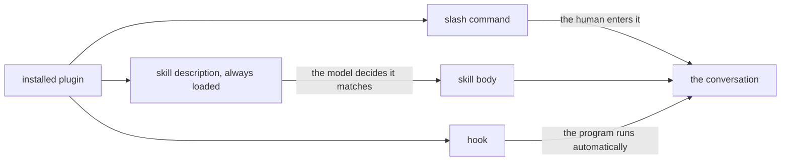

# How a plugin comes to apply

An installed plugin does nothing on its own simply by being installed. Its content must
enter the conversation at a specific moment. Three distinct mechanisms govern this, each
with different characteristics, and conflating them accounts for most complaints that
"the plugin does not work".

## A plugin enters the conversation by three roads

| Mechanism | Who decides | When it applies |
|---|---|---|
| Slash command | the human, explicitly | when the command is entered |
| Description matching | the model, from request phrasing | when the described situation arises |
| Hook | the program, automatically | at the designated point, without a decision |

In summary: a slash command enters when the human types it; a hook fires whenever the
software executes it, without consulting anyone. Along the middle path, only the
description is loaded initially; the body of the skill arrives only after the model
determines that the description fits the request.

### The slash command: the human decides

This is the most predictable route. `/ponytail ultra` does exactly one thing,
immediately.

Of the four plugins, three provide commands: ponytail (6), caveman (5), and RTK (1).
Ponytail determines how much code is written, caveman compresses model responses, and
RTK shortens command output before it reaches the conversation.

**Superpowers has none** — the plugin contains no `commands/` folder. Superpowers
governs workflow order, and its 14 skills (instruction sets loaded into the conversation
whenever a situation calls for them) are accessible exclusively through the second
mechanism.

This is the most critical practical takeaway in the entire document: for the most
substantial plugin of the four, request phrasing is the only available lever.

### Description matching: the model decides

Every skill includes a `description` field that remains permanently loaded in context.
The model inspects it and decides whether the skill applies. Only when the model decides
it does is the skill body loaded.

The descriptions in superpowers all follow the exact same template: they specify the
trigger condition, never the method:

> Use when implementing any feature or bugfix, before writing implementation code

The phrasing does not explain what the skill does; it states only when it applies.

### The hook: the program runs without asking

Hooks run automatically without consulting anyone. Ponytail injects its rules on every
`UserPromptSubmit` event, which fires with every message sent. Caveman does the same.
This is why both modes remain active continuously and must be disabled through explicit
phrasing — "stop ponytail" — rather than by merely changing the topic.

## Why the descriptions do not say what the skill does

This design choice is counterintuitive, but it emerged from empirical testing rather
than stylistic preference.

The document `writing-skills/SKILL.md` records what occurred when a skill description
summarized the process. That description read "code review between tasks".

The agent performed only **one** review, even though the diagram inside the skill body
required **two**: spec compliance first, then code quality. Once the description was
changed to "use when executing implementation plans with independent tasks", dropping any
summary of the method, the agent consulted the diagram and conducted both reviews.

The explanation: a summary in the description becomes a shortcut. Whenever a
description appears to explain what needs to be done, the model treats the skill body as
optional text.

**The consequence for prompt writers:** mentioning a skill by name does not guarantee it
will be applied. The name invokes only the description; the actual behavior resides in
the body. A prompt that outlines the **situation** triggers a read of the skill body far
more reliably than one that merely cites a label.

For skill authors, the inverse holds: any description that summarizes the method ends up
undermining its own content.

## Why "use skill X" is not enough

Direct phrasing works and remains entirely valid. Its limitation lies elsewhere: it
assumes beforehand which of the 14 skills is appropriate. For tasks spanning multiple
phases — precisely the work where superpowers delivers value — the right choice is
rarely obvious at the outset.

The `using-superpowers` skill establishes an execution order when several skills apply:
process skills run first to frame the approach, after which implementation skills execute
it. "Let's build X" routes to `brainstorming` before implementation; "fix this bug"
triggers `systematic-debugging` first.

Requesting an implementation skill directly bypasses this sequencing entirely.

## The rejected alternative: everything through commands

An apparent alternative would be giving every skill its own slash command, just as
ponytail does. Superpowers deliberately chose against this approach, for reasons evident
in how its descriptions are structured.

A command requires the human to know the current phase before submitting the request.
Yet the right phase often becomes apparent only after reading the code — a request
phrased as "add X" frequently turns into "first understand why X is missing". Description
matching allows this decision to take place once the situation is known, not before.

The trade-off is reduced predictability. The benefit is that the appropriate phase can
be selected mid-task rather than solely at the outset.
