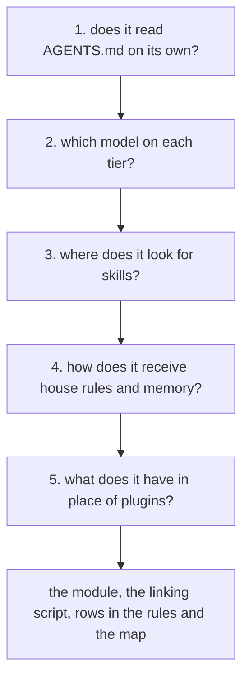

# Add a new tool

An AI coding tool works in the workspace like any other once it receives four things:
the shared rules, tiered models, the house skills, and the house rules with memory. This
guide explains what changes based on how the tool answers five questions.

The shared rules sit in `AGENTS.md` (the file with the shared rules, loaded by every
session in any tool). What belongs to a single tool sits in its module (the file with
what belongs to a single tool, such as `CLAUDE.md` and `GEMINI.md`).

Each answer is taken from the tool's documentation, then confirmed with a test:
a unique word written in a file, asking the tool whether it sees it.

## 1. Does it read `AGENTS.md` on its own?

Find the names of the rule files the tool loads, and from which folders: only from
the open folder, or from its parents as well.

| The answer | What to do |
|---|---|
| yes, from the open folder and from parents | nothing: the shared rules arrive on their own |
| yes, but only from the open folder | local files in each repository and rules folder pull in parent rules, one per include, as in Antigravity |
| no, it reads another file | its module takes the name the tool looks for and begins with an import of `AGENTS.md` |

A new module is added to `MODULE` in `bin/check-docs.py` so the verification keeps them
paired: without `AGENTS.md` beside it or without the import on the first line, it fails.

## 2. Which model on each tier?

The plan header writes tiers using the house names: "Opus", the heavy tier, and
"Sonnet", the execution tier, each with an effort level. The tool's module receives the
"Models by role" table, listing the model for each tier along with the identifier
used to select it.

A tool that reads `AGENTS.md` on its own still receives a module if it is used across
roles: the tier table has nowhere else to live.

## 3. Where does it look for skills?

The house skills (sets of instructions that enter the conversation when the situation
matches) are folders containing a `SKILL.md`. The same files serve any tool that
understands the format, so they are not copied unless necessary.

Find the global directory where the tool looks for them and whether it follows symlinks:
link a test skill there that responds with a specific word.

- it follows symlinks: link the skills, as in `bin/antigravity.sh`;
- it does not follow them: copy them, and have the script check on every run that they
  remain identical to the source;
- the tool has no built-in skill loader: the module explains how to load one, for
  instance by reading its `SKILL.md`.

## 4. How does it receive house rules and memory?

The house rules sit in `records/house-rules.md`, and the memory index sits in
`records/memory/MEMORY.md`, both in the personal layer (the clone of the human's private
repository). Each tool receives them differently:

| Tool | How |
|---|---|
| Claude Code | a user rule, `~/.claude/rules/house-rules.md`, brings the house rules; memory is linked by `bin/restore-env.sh` |
| Antigravity | the open folder's local files include both |
| a new tool | its own local file, written by its script and kept out of git |

How memory is written is described in `AGENTS.md` under "Agent memory", so all
tools write to the same memory in the same format.

## 5. What does it have in place of plugins?

In Claude Code, superpowers, caveman, ponytail, and RTK work through hooks (small
programs the tool runs on its own at specific moments: at session startup, on every
message, before a command). For a new tool, look for the equivalent:

| What the plugin does in Claude Code | What to look for in the new tool |
|---|---|
| superpowers loads the `using-superpowers` skill at startup | an always-active rule that includes it, from the clone pinned in `plugins.lock.json` |
| caveman and ponytail set their mode at startup and on every message | an always-active rule containing the mode's text |
| RTK rewrites commands before they run | a hook capable of rewriting; otherwise, a rule requiring `rtk` in front of commands |

## What changes at the end

1. The tool's module, if it has something to say, based on answers 1 and 2.
2. A row in the "Tools" table in `AGENTS.md`.
3. Its row in the handoff (the note in `STATE.md` for the next session), in the format
   from `skills/end-of-session/references/state-and-records.md`.
4. A `bin/<tool>.sh` script modeled on `bin/antigravity.sh`, called from
   `bin/restore-env.sh` only when the tool is installed, with its test in `tests/`.
5. Its rows in `IMPACT.md`, the impact map (the table of what breaks at each change,
   with the command that checks it).
6. A reference in `docs/reference/`, detailing the tests performed and what each decided.

Verification from the root: `python3 bin/check-docs.py .`, the script's test, and a test
with canary words in each rule file, run in the new tool.
