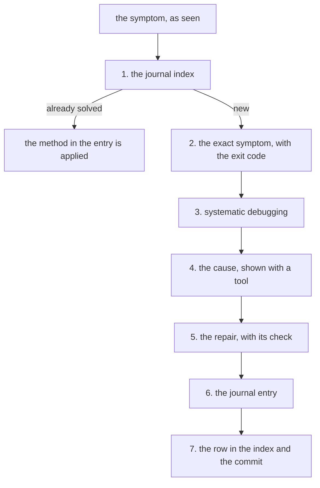

# How to solve an environment problem, and how it gets into the journal

An **environment** issue belongs to the machine or tooling—plugins, `node`, scripts,
services, hardware—rather than project code. A project's pitfalls (what cost time, with
the method by which it was found) live in its own `records/pitfalls/`.

Every resolution goes into the journal (the system problems solved, with the symptom, the
cause and the method). The laptop and the environment are recorded in the personal
layer's journal (`records/`, the clone of a private repository of the human's, with
their records).

A dedicated machine maintained by a project, or a project-specific tool installed on the
laptop, belongs in that project's git-tracked journal instead.

This guide has two parts: finding the root cause, and documenting the findings so they
remain useful the next time.



The journal index is checked first, because the problem may already be solved. If it is
new, the exact symptom is recorded, systematic debugging is requested, and the cause is
proven with a tool rather than guessed. The fix is verified against the failing command,
then documented in the journal and its index.

All commands run from the workspace root (the folder into which the environment's
repository was cloned). No path in this guide is absolute.

## 1. Check first whether it is already solved

A five-second check saves solving the same problem twice.

```bash
cat records/journal/INDEX.md
```

The index provides a symptom column because a recurring problem is recognized by what
**is seen**, not by its formal diagnosis.

If the index yields nothing, search the body of the entries directly:

```bash
/usr/bin/grep -rn -i '<word from the error message>' records/journal/
```

⚠ **`/usr/bin/grep` is used, not `grep`.** The shell function respects `.gitignore`, and
the framework ignores `records/`: an ordinary `grep` finds nothing there and gives no
warning.

## 2. Write down the exact symptom, before any hypothesis

Capture what was actually observed rather than "the script does not work": the exact
command invoked, the full output, and the exit code.

```bash
<command>; echo "code: $?"
```

An exit code is concrete evidence, not a minor detail. In one real case, the hypothesis
predicted code 127 while the actual run produced 1. That discrepancy prevented an
ill-advised patch that would have left the true cause intact. Two separate bugs existed,
and the first one uncovered was not the one causing the failure.

A symptom summarized by the observer loses the very detail that separates competing
hypotheses. If someone else reports the problem, ask for the exact specifics: how many,
which ones, when, and whether it occurs consistently or intermittently.

## 3. Ask the agent for systematic debugging

The prompt below invokes `systematic-debugging`—the skill (a set of instructions that
enters the conversation when the situation matches) that requires hypotheses ranked by
evidence rather than guesswork fixes:

```
<command> exits with <code> and writes <the exact output>. I do not know why.
Debug systematically, do not propose the repair before the cause.
```

What the skill does: it prioritizes hypotheses, requires a command that can **disprove**
each one, and blocks any repair until the cause is demonstrated rather than suspected.

⚠ **Never jump straight to "fix it".** A repair applied to a symptom leaves the root cause
in place and creates the illusion of a fix—hiding the problem until it resurfaces later,
when it is far more expensive.

## 4. The tools that find the cause most often

| The situation | What is run |
|---|---|
| a script exits silently | `bash -x script`—inspect the **last line executed**, not whichever looks suspicious |
| a script with `trap … EXIT` | the final output line is the trap itself, making the line before it the point of failure |
| a service is silent | `journalctl -u <unit> -n 50 --no-pager` |
| a command works in a terminal but fails in a service | run it under the service context, with `sudo -k` beforehand and no `sudo` afterward |
| an application's output destination is unknown | start the program, then search for files modified in the last minute |
| a tool appears to skip items | inspect **what was skipped**, not just what was returned |

⚠ **The test environment is itself a tool, and often the least verified.** An interactive
terminal provides `TERM`, `stdin`, a tty, and—most deceptively—a `sudo` timestamp; a
systemd service has none of these. Testing in conditions that differ from production can
confirm a false explanation for years.

## 5. Prove the repair on the command that failed

The check is the command that showed the symptom. An issue is not considered fixed
until the symptom disappears **on the exact same command** that revealed it.

```bash
<the command that failed>; echo "code: $?"
```

⚠ **The check command must also be able to fail.** If the check passes against
unmodified code, it proves nothing. Testing requires a paired verification: the check must
fail with the fix reverted, and pass once the fix is restored.

## 6. Write the journal entry, in the same session

The entry is written **in the same session**, while evidence remains visible on screen.
Rejected hypotheses are forgotten on the day they are dismissed.

The file name:

```
records/journal/YYYY-MM-DD-short-subject.md
```

Prefixing the date aligns alphabetical order with chronological order—the filesystem
handles sorting automatically, without requiring a manually maintained field.

The title of the document must be the **symptom**, not the diagnosis. A recurring
problem is recognized by what is observed, not by what its cause turned out to be:

- ✅ "`restore-env.sh` exits with 1 without writing anything, although the restore had succeeded"
- ❌ "A problem with `pipefail` in the chain of fallbacks"

The body consists of three required sections:

### The symptom

Record exactly what was observed, placing the raw output in a code block. Include what
**should** have appeared but was missing—an absence is harder to detect than an active
error, so it must be stated explicitly.

### The cause, with evidence

Provide the command that exposed the cause along with its output. Document the actual
**proof** rather than just a narrative explanation. When multiple factors combine to
trigger the failure, list each one: "three conditions coincide, and no single one would
suffice on its own."

### The method, formulated in general terms

This is the reusable portion. The specific outcome belongs to the immediate problem,
whereas the investigative method applies broadly.

An entry lacking a method records an isolated result rather than a lesson. Six months
later, the specific bug will not recur, but another issue of identical shape easily
might.

Document any **rejected** hypotheses alongside the reasons they failed. Without that
record, someone will retest them—and a plausible yet mistaken hypothesis is the first
thing someone is bound to retry.

## 7. Add the entry's row to the index, then commit

The new entry receives a row in the table inside `records/journal/INDEX.md`. The row
contains three cells:

| Cell | What it contains |
|---|---|
| 1 | the **symptom**, as observed—not the diagnosis |
| 2 | the date, `YYYY-MM-DD` |
| 3 | a markdown link to the file, repeating its filename as both the text and the target |

The link target must be relative to `records/journal/` where the index lives, so it is
simply the filename without any leading path components. Writing a root-relative path
might pass visual inspection, but fails `bin/check-docs.py`.

Use an existing row in `INDEX.md` as a template by copying it and updating the three
cells. Formatting conventions appear at the top of `INDEX.md`, while host machine
details are noted under "Where" in the entry itself.

Then run the check and the commit:

```bash
python3 bin/check-docs.py . && git add -A && git commit -q -m "<what was learned, not what was changed>"
```

---

## Prompts to use

**Starting the debugging**—brings `systematic-debugging`:

```
`./bin/restore-env.sh` exits with code 1 and writes no error message, although the
restore seems to have succeeded: the last line written is "skill documentation linked",
and the confirmation line is missing.

Debug systematically. Do not propose the repair before showing the cause.
```

Why this works: it provides the exact command, the exit code, the last line observed
**and** the missing line, then explicitly requests the investigative method.

**When an initial hunch exists**—state it as a suspicion, never as a fact:

```
I suspect it comes from `pipefail`, but the observed code is 1 and my hypothesis would
give 127. Check the hypothesis before we use it, and say whether the code disproves it.
```

Why this works: it pairs the prediction **and** the contradictory observation. A
hypothesis predicting a different exit code from the one observed is incorrect, even if the
defect it describes really exists.

**When the fix is ready and must be proven:**

```
Show the check: run the command that failed, then remove the repair and show that
the check really fails without it.
```

**When drafting the journal entry:**

```
/caveman off
Write the journal entry for this: the symptom, the cause with evidence, the method
formulated in general terms. Put in the hypotheses we rejected too, with the reason.
Add the row to the index.
```

`/caveman off` stops the compressed response mode so the journal entry is written for
someone outside the field. The rules governing response modes sit in `AGENTS.md`
(the shared rules file loaded by every session in any tool), under "Modes".

## A complete example, from symptom to entry

Here is how a real investigation produced the entry "`restore-env.sh` exits with 1 without
writing anything"—searchable by its symptom in `records/journal/INDEX.md`:

1. **The measured symptom:** the script performed every expected step—cloning four
   marketplaces, installing four plugins, and writing configurations—yet exited with code 1
   without an error message, omitting the final confirmation line. A separate inspection
   confirmed that the restore had actually succeeded.
2. **The first hypothesis, plausible but incorrect:** variable names containing
   diacritics. That defect was real, but it would have produced exit code 127 rather than
   the observed 1. It was noted as a secondary bug rather than the root cause.
3. **The cause, isolated with `bash -x`:** the last line executed was the second fallback
   in a binary search chain. Running `find` on a nonexistent directory exited with 1,
   `pipefail` propagated the failure code through `head`, and `set -e` aborted the
   script—preventing the third fallback, the only one that located the binary, from ever running.
4. **The method recorded in the journal**, formulated as three general rules: an observed
   exit code is definitive evidence; `set -e` combined with `pipefail` collapses a chain of
   fallbacks into a single attempt; and a script terminating silently must be diagnosed
   with `bash -x`, not visual guesswork.

That fourth part is the only one that remains valuable six months later.
